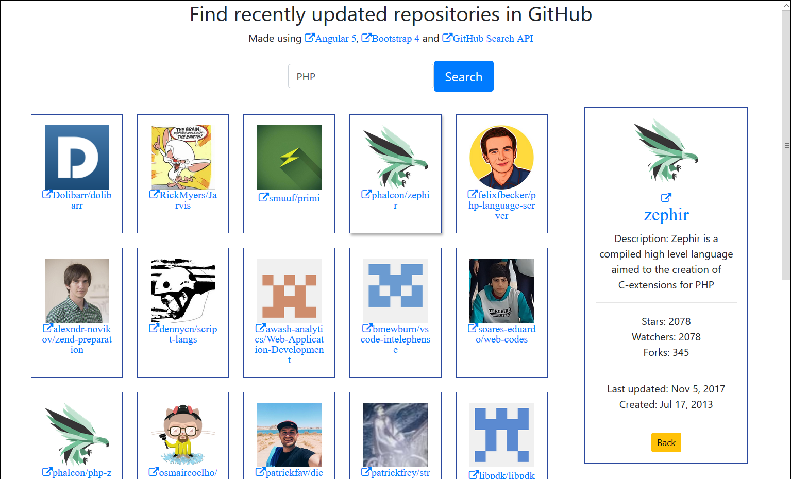

## Find recently updated repositories in GitHub by programming language

 Made using [Angular 5](https://angular.io/), [Bootstrap 4](https://getbootstrap.com/), [GitHub Search API 3](https://developer.github.com/v3/search/#search-repositories), [NodeJS 8](https://nodejs.org/en/), and [Visual Studio Code 1](https://code.visualstudio.com/)
 
 Code is based on the tutorial [Make Angular 4 app using GitHub API]( https://applyhead.com/angular-4-tutorial-make-angular-4-app-using-github-api/)
 
 Instead of searching for developers, the code now searches for recently updated repositories in GitHub.  
 Also, the code was updated to work with Angular 5 and Bootstrap 4.  
 And of course the normal searching google, stackoverflow, and related offical documentations.
 
 Screenshot of application
 

 
 
## Clone this repo

`git clone https://github.com/mbrowniebytes/angular-search-language.git`

## Install packages

`npm install`  
`npm install -g @angular/cli`  
`npm install bootstrap@next`  
`npm install font-awesome`  

## Serve the project and visit localhost:4200

`npm serve`
